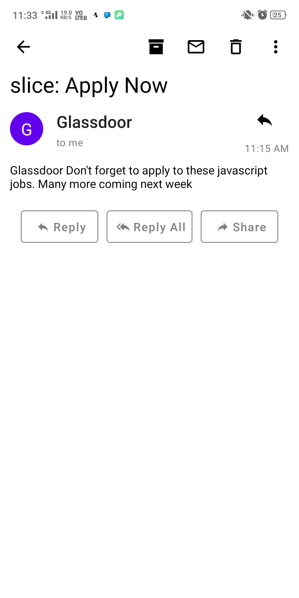

# Gmail Clone

A Gmail clone developed with REact Native.

## Screenshots

    
    
    
    

## Requirements

- Node.js
- Expo / React Native CLI

## Installation

In the project directory run:

### `npm install`

## Run

In the project directory run:

### `expo start`